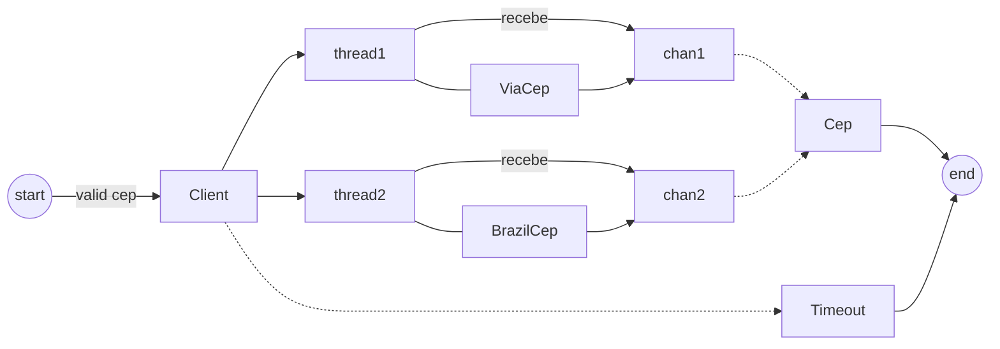

# Desafio multithread em golang

Exercício do curso go-expert para estudos sobre threads no go

- Para executar:
make run-client
make run-client-via
make run-client-brazil

obs: o CEP usado no make é 01311200, mas vc pode mudar para qualquer outro.

- Para ver o diagrama:
instalar o plugin Markdown Preview Enhanced

## Overview

Desafio esta completo, mas penso em criar uma V2 com:
- swagger
- fiber e um endpoint que retorne o único cep (o q responder mais rápido)

### Challenge

 Neste desafio você terá que usar o que aprendemos com Multithreading e APIs para buscar o resultado mais rápido entre duas APIs distintas.

As duas requisições serão feitas simultaneamente para as seguintes APIs:

https://brasilapi.com.br/api/cep/v1/01153000 + cep

http://viacep.com.br/ws/" + cep + "/json/

Os requisitos para este desafio são:

- Acatar a API que entregar a resposta mais rápida e descartar a resposta mais lenta.

- O resultado da request deverá ser exibido no command line com os dados do endereço, bem como qual API a enviou.

- Limitar o tempo de resposta em 1 segundo. Caso contrário, o erro de timeout deve ser exibido.

## Workflow Diagram

Apresenta uma ideia do desafio

